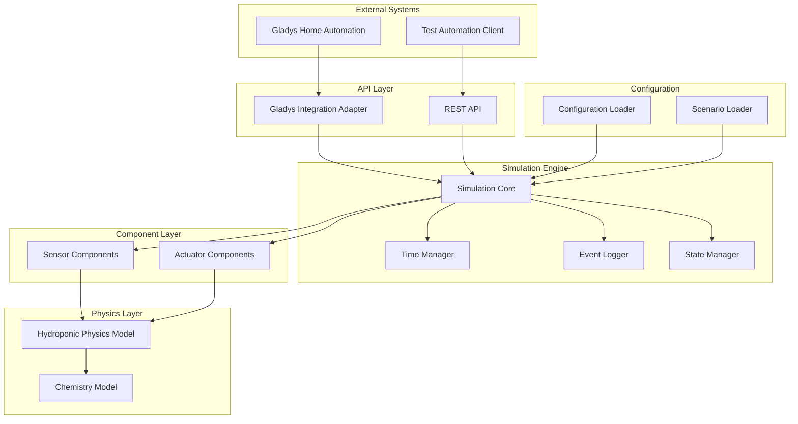
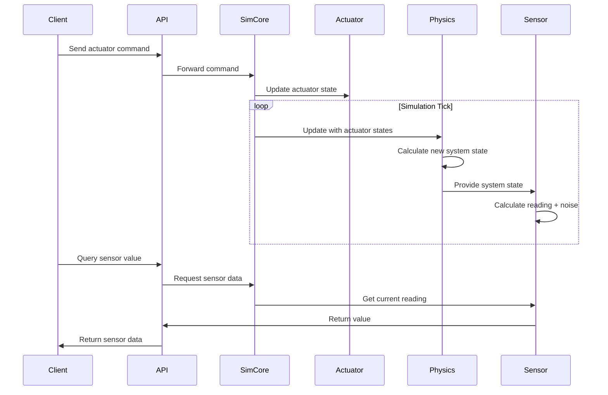

# Design Document: Hydroponic Test Simulation

## Overview

The hydroponic test simulation system provides a comprehensive software-based emulation of hydroponic hardware for testing Gladys home automation integration without physical equipment. The simulator models the complex interactions between sensors (pH, EC, temperature, water level), actuators (pumps, lights, valves), and the hydroponic environment itself.

The system architecture separates concerns into distinct layers:
- **Simulation Engine**: Core time-stepping and state management
- **Component Layer**: Individual sensor and actuator implementations
- **Physics Model**: Realistic hydroponic system dynamics
- **Integration Layer**: Gladys API compatibility
- **Control Layer**: REST API for test automation

Key design goals include:
- Realistic behavior that accurately reflects physical hydroponic systems
- Deterministic simulation for reproducible testing
- Time acceleration for rapid testing of long-duration scenarios
- Flexible configuration for different system types
- State persistence for pause/resume workflows

## Architecture

### System Components



### Simulation Loop

The simulation operates on a discrete time-stepping model:

1. **Time Advance**: TimeManager advances simulation time by delta_t
2. **Actuator Processing**: Process pending actuator commands
3. **Physics Update**: Update hydroponic system state based on actuators and time
4. **Sensor Update**: Calculate new sensor readings from system state
5. **Event Logging**: Record state changes and events
6. **API Response**: Return updated values to external systems

Time acceleration is implemented by scaling delta_t while maintaining the same update frequency for external APIs.

### Data Flow



## Components and Interfaces

### Simulation Core

The central orchestrator managing all simulation components.

```typescript
interface SimulationCore {
  // Lifecycle management
  start(): void;
  stop(): void;
  pause(): void;
  resume(): void;
  
  // Time control
  setTimeAcceleration(factor: number): void;
  getSimulatedTime(): number;
  getRealTime(): number;
  
  // Component access
  getSensor(id: string): Sensor;
  getActuator(id: string): Actuator;
  
  // State management
  saveState(filepath: string): void;
  loadState(filepath: string): void;
  
  // Scenario management
  loadScenario(filepath: string): void;
  
  // Configuration
  updateConfig(config: SimulationConfig): void;
}
```

### Sensor Components

Base interface for all sensor types with common behavior.

```typescript
interface Sensor {
  id: string;
  type: SensorType;
  
  // Current reading with noise applied
  getValue(): number;
  
  // Raw value from physics model (no noise)
  getRawValue(): number;
  
  // Configuration
  setBaseline(value: number): void;
  setNoiseLevel(stddev: number): void;
  
  // Update from physics model
  updateFromPhysics(systemState: HydroponicState): void;
}

enum SensorType {
  PH = 'ph',
  EC = 'ec',
  TEMPERATURE = 'temperature',
  WATER_LEVEL = 'water_level'
}

class PHSensor implements Sensor {
  private baseline: number;
  private noiseStdDev: number;
  private currentValue: number;
  
  getValue(): number {
    return this.currentValue + this.generateNoise();
  }
  
  private generateNoise(): number {
    // Gaussian noise within ±0.1 pH units
  }
}

// Similar implementations for ECSensor, TemperatureSensor, WaterLevelSensor
```

### Actuator Components

Base interface for all actuator types.

```typescript
interface Actuator {
  id: string;
  type: ActuatorType;
  
  // Command handling
  setState(state: ActuatorState): void;
  getState(): ActuatorState;
  
  // Failure simulation
  setFailureProbability(probability: number): void;
  isFailed(): boolean;
  
  // Maintenance tracking
  getTotalRuntime(): number;
  
  // Effect on physics model
  getPhysicsEffect(): PhysicsEffect;
}

enum ActuatorType {
  PUMP = 'pump',
  LIGHT = 'light',
  VALVE = 'valve'
}

interface ActuatorState {
  active: boolean;
  intensity?: number; // For lights (0-100%)
  timestamp: number;
}

interface PhysicsEffect {
  waterDelta?: number;
  nutrientDelta?: number;
  temperatureDelta?: number;
  phDelta?: number;
}

class PumpActuator implements Actuator {
  private state: ActuatorState;
  private pumpType: PumpType; // water, nutrient, pH_up, pH_down
  private flowRate: number;
  private failureProbability: number;
  private totalRuntime: number;
  
  setState(state: ActuatorState): void {
    if (this.checkFailure()) {
      throw new ActuatorFailureError();
    }
    this.state = state;
  }
  
  getPhysicsEffect(): PhysicsEffect {
    if (!this.state.active) return {};
    
    switch (this.pumpType) {
      case PumpType.WATER:
        return { waterDelta: this.flowRate };
      case PumpType.NUTRIENT:
        return { nutrientDelta: this.flowRate, waterDelta: this.flowRate };
      case PumpType.PH_UP:
        return { phDelta: 0.1 };
      case PumpType.PH_DOWN:
        return { phDelta: -0.1 };
    }
  }
}

// Similar implementations for LightActuator, ValveActuator
```

### Hydroponic Physics Model

Models the physical and chemical behavior of the hydroponic system.

```typescript
interface HydroponicPhysicsModel {
  // State update
  update(deltaTime: number, actuatorEffects: PhysicsEffect[]): void;
  
  // State queries
  getState(): HydroponicState;
  
  // Configuration
  setReservoirCapacity(liters: number): void;
  setEvaporationRate(litersPerHour: number): void;
  setPlantUptakeRate(litersPerHour: number): void;
}

interface HydroponicState {
  // Water properties
  waterVolume: number; // liters
  waterLevel: number; // percentage
  temperature: number; // celsius
  
  // Chemical properties
  ph: number;
  ec: number; // mS/cm
  nutrientConcentration: number; // ppm
  
  // Environmental
  ambientTemperature: number;
  
  // Time
  simulatedTime: number;
}

class HydroponicPhysicsModelImpl implements HydroponicPhysicsModel {
  private state: HydroponicState;
  private config: PhysicsConfig;
  private chemistryModel: ChemistryModel;
  
  update(deltaTime: number, actuatorEffects: PhysicsEffect[]): void {
    // Apply actuator effects
    this.applyActuatorEffects(actuatorEffects);
    
    // Natural processes
    this.applyEvaporation(deltaTime);
    this.applyPlantUptake(deltaTime);
    this.applyTemperatureDrift(deltaTime);
    this.applyPHDrift(deltaTime);
    
    // Chemistry interactions
    this.chemistryModel.updatePHFromTemperature(this.state);
    this.chemistryModel.updateECFromDilution(this.state);
    this.chemistryModel.applyBuffering(this.state);
    
    // Update derived values
    this.updateWaterLevel();
  }
  
  private applyEvaporation(deltaTime: number): void {
    const evaporated = this.config.evaporationRate * deltaTime;
    this.state.waterVolume -= evaporated;
    // EC increases as water evaporates (concentration effect)
    this.state.ec *= (this.state.waterVolume + evaporated) / this.state.waterVolume;
  }
  
  private applyPlantUptake(deltaTime: number): void {
    const consumed = this.config.plantUptakeRate * deltaTime;
    this.state.waterVolume -= consumed;
    // Plants consume nutrients, reducing EC
    const nutrientConsumed = this.config.nutrientUptakeRate * deltaTime;
    this.state.nutrientConcentration -= nutrientConsumed;
    this.state.ec = this.chemistryModel.calculateECFromNutrients(
      this.state.nutrientConcentration
    );
  }
}
```

### Chemistry Model

Handles chemical interactions and relationships.

```typescript
interface ChemistryModel {
  // pH calculations
  calculatePHFromTemperature(ph: number, temp: number): number;
  applyPHBuffer(ph: number, bufferCapacity: number): number;
  calculatePHFromNutrientAddition(ph: number, nutrientType: string, amount: number): number;
  
  // EC calculations
  calculateECFromNutrients(concentration: number): number;
  calculateECFromDilution(ec: number, volumeBefore: number, volumeAfter: number): number;
  
  // Nutrient lockout
  isNutrientLockout(ph: number): boolean;
  getLockoutFactor(ph: number): number;
}

class ChemistryModelImpl implements ChemistryModel {
  calculatePHFromTemperature(ph: number, temp: number): number {
    // pH decreases approximately 0.01 units per degree Celsius increase
    const tempDelta = temp - 25.0; // Reference temperature
    return ph - (tempDelta * 0.01);
  }
  
  applyPHBuffer(ph: number, bufferCapacity: number): number {
    // Simulate buffering effect that resists pH changes
    const targetPH = 7.0;
    const drift = ph - targetPH;
    return ph - (drift * bufferCapacity * 0.1);
  }
  
  isNutrientLockout(ph: number): boolean {
    // Nutrient lockout occurs outside 5.5-6.5 range for hydroponics
    return ph < 5.5 || ph > 6.5;
  }
  
  getLockoutFactor(ph: number): number {
    if (ph >= 5.5 && ph <= 6.5) return 1.0;
    if (ph < 5.0 || ph > 7.0) return 0.5; // Severe lockout
    return 0.75; // Moderate lockout
  }
}
```

### Gladys Integration Adapter

Bridges the simulator with Gladys device API.

```typescript
interface GladysIntegrationAdapter {
  // Device discovery
  discoverDevices(): GladysDevice[];
  
  // Sensor queries
  getSensorValue(deviceId: string): number;
  
  // Actuator commands
  sendActuatorCommand(deviceId: string, command: ActuatorCommand): void;
  
  // Device management
  registerDevice(device: GladysDevice): void;
  unregisterDevice(deviceId: string): void;
}

interface GladysDevice {
  id: string;
  name: string;
  type: 'sensor' | 'actuator';
  model: string;
  features: GladysFeature[];
}

interface GladysFeature {
  id: string;
  name: string;
  category: string; // 'ph-sensor', 'ec-sensor', 'pump', etc.
  type: 'decimal' | 'binary';
  unit?: string;
  min?: number;
  max?: number;
}

class GladysIntegrationAdapterImpl implements GladysIntegrationAdapter {
  private simCore: SimulationCore;
  private deviceMap: Map<string, string>; // Gladys ID -> Simulator ID
  
  discoverDevices(): GladysDevice[] {
    const devices: GladysDevice[] = [];
    
    // Register all sensors
    for (const sensor of this.simCore.getAllSensors()) {
      devices.push(this.createGladysDevice(sensor));
    }
    
    // Register all actuators
    for (const actuator of this.simCore.getAllActuators()) {
      devices.push(this.createGladysDevice(actuator));
    }
    
    return devices;
  }
  
  getSensorValue(deviceId: string): number {
    const sensorId = this.deviceMap.get(deviceId);
    const sensor = this.simCore.getSensor(sensorId);
    return sensor.getValue();
  }
  
  sendActuatorCommand(deviceId: string, command: ActuatorCommand): void {
    const actuatorId = this.deviceMap.get(deviceId);
    const actuator = this.simCore.getActuator(actuatorId);
    actuator.setState({
      active: command.value > 0,
      intensity: command.intensity,
      timestamp: Date.now()
    });
  }
}
```

### REST API

Provides programmatic access for test automation.

```typescript
interface RestAPIServer {
  start(port: number): void;
  stop(): void;
}

// API Endpoints:
// GET /api/sensors - List all sensors
// GET /api/sensors/:id - Get sensor value
// GET /api/actuators - List all actuators
// POST /api/actuators/:id - Send actuator command
// POST /api/scenario - Load test scenario
// POST /api/simulation/start - Start simulation
// POST /api/simulation/stop - Stop simulation
// POST /api/simulation/pause - Pause simulation
// POST /api/simulation/resume - Resume simulation
// GET /api/simulation/status - Get simulation status
// POST /api/simulation/time-acceleration - Set time acceleration
// POST /api/state/save - Save state to file
// POST /api/state/load - Load state from file

interface APIResponse<T> {
  success: boolean;
  data?: T;
  error?: string;
  timestamp: number;
  simulatedTime: number;
}

interface SensorValueResponse {
  id: string;
  type: string;
  value: number;
  unit: string;
  timestamp: number;
}

interface ActuatorCommandRequest {
  state: boolean;
  intensity?: number;
}

interface SimulationStatusResponse {
  running: boolean;
  paused: boolean;
  simulatedTime: number;
  realTime: number;
  timeAcceleration: number;
}
```

### Configuration Management

```typescript
interface SimulationConfig {
  // Reservoir configuration
  reservoir: {
    capacity: number; // liters
    initialWaterLevel: number; // percentage
  };
  
  // Sensor configurations
  sensors: {
    ph: SensorConfig;
    ec: SensorConfig;
    temperature: SensorConfig;
    waterLevel: SensorConfig;
  };
  
  // Actuator configurations
  actuators: {
    pumps: ActuatorConfig[];
    lights: ActuatorConfig[];
    valves: ActuatorConfig[];
  };
  
  // Physics parameters
  physics: {
    evaporationRate: number; // liters/hour
    plantUptakeRate: number; // liters/hour
    nutrientUptakeRate: number; // ppm/hour
    ambientTemperature: number; // celsius
    temperatureDriftRate: number; // celsius/hour
    phDriftRate: number; // pH units/hour
  };
  
  // Simulation parameters
  simulation: {
    tickRate: number; // updates per second
    timeAcceleration: number;
  };
  
  // Logging configuration
  logging: {
    level: 'debug' | 'info' | 'warning' | 'error';
    filepath: string;
    rotationPolicy: 'daily' | 'size';
    maxSize?: number; // MB
  };
}

interface SensorConfig {
  id: string;
  baseline: number;
  noiseStdDev: number;
  driftRate: number;
}

interface ActuatorConfig {
  id: string;
  type: string;
  flowRate?: number;
  failureProbability: number;
}

class ConfigurationLoader {
  loadFromFile(filepath: string): SimulationConfig {
    const json = readFileSync(filepath, 'utf-8');
    const config = JSON.parse(json);
    this.validate(config);
    return this.applyDefaults(config);
  }
  
  validate(config: any): void {
    // JSON schema validation
    const schema = this.getConfigSchema();
    const valid = validateAgainstSchema(config, schema);
    if (!valid) {
      throw new ConfigValidationError(getValidationErrors());
    }
  }
  
  applyDefaults(config: Partial<SimulationConfig>): SimulationConfig {
    return {
      ...DEFAULT_CONFIG,
      ...config
    };
  }
}
```

### Test Scenario Management

```typescript
interface TestScenario {
  name: string;
  description: string;
  
  // Initial conditions
  initialState: {
    ph: number;
    ec: number;
    temperature: number;
    waterLevel: number;
  };
  
  // Scheduled events
  events: ScenarioEvent[];
  
  // Failure conditions
  failures?: {
    actuatorId: string;
    failureTime: number; // simulated seconds
    duration: number;
  }[];
}

interface ScenarioEvent {
  time: number; // simulated seconds from start
  type: 'actuator_command' | 'parameter_change' | 'disturbance';
  target: string;
  value: any;
}

class ScenarioLoader {
  loadFromFile(filepath: string): TestScenario {
    const json = readFileSync(filepath, 'utf-8');
    const scenario = JSON.parse(json);
    this.validate(scenario);
    return scenario;
  }
  
  validate(scenario: any): void {
    const schema = this.getScenarioSchema();
    const valid = validateAgainstSchema(scenario, schema);
    if (!valid) {
      throw new ScenarioValidationError(getValidationErrors());
    }
  }
  
  applyScenario(simCore: SimulationCore, scenario: TestScenario): void {
    // Set initial state
    simCore.getSensor('ph').setBaseline(scenario.initialState.ph);
    simCore.getSensor('ec').setBaseline(scenario.initialState.ec);
    simCore.getSensor('temperature').setBaseline(scenario.initialState.temperature);
    simCore.getSensor('water_level').setBaseline(scenario.initialState.waterLevel);
    
    // Schedule events
    for (const event of scenario.events) {
      simCore.scheduleEvent(event);
    }
    
    // Configure failures
    if (scenario.failures) {
      for (const failure of scenario.failures) {
        simCore.scheduleFailure(failure);
      }
    }
  }
}
```

### State Persistence

```typescript
interface StatePersistence {
  save(filepath: string): void;
  load(filepath: string): void;
}

interface SimulationState {
  version: string;
  timestamp: number;
  simulatedTime: number;
  
  // Sensor states
  sensors: {
    [id: string]: {
      type: string;
      baseline: number;
      currentValue: number;
      noiseStdDev: number;
    };
  };
  
  // Actuator states
  actuators: {
    [id: string]: {
      type: string;
      state: ActuatorState;
      totalRuntime: number;
      failed: boolean;
    };
  };
  
  // Physics state
  hydroponicState: HydroponicState;
  
  // Configuration
  config: SimulationConfig;
}

class StatePersistenceImpl implements StatePersistence {
  constructor(private simCore: SimulationCore) {}
  
  save(filepath: string): void {
    const state: SimulationState = {
      version: '1.0.0',
      timestamp: Date.now(),
      simulatedTime: this.simCore.getSimulatedTime(),
      sensors: this.serializeSensors(),
      actuators: this.serializeActuators(),
      hydroponicState: this.simCore.getPhysicsModel().getState(),
      config: this.simCore.getConfig()
    };
    
    writeFileSync(filepath, JSON.stringify(state, null, 2));
  }
  
  load(filepath: string): void {
    const json = readFileSync(filepath, 'utf-8');
    const state: SimulationState = JSON.parse(json);
    this.validate(state);
    this.restoreState(state);
  }
  
  validate(state: SimulationState): void {
    const schema = this.getStateSchema();
    const valid = validateAgainstSchema(state, schema);
    if (!valid) {
      throw new StateValidationError(getValidationErrors());
    }
  }
}
```

### Event Logging

```typescript
interface EventLogger {
  log(level: LogLevel, message: string, context?: any): void;
  logSensorChange(sensorId: string, oldValue: number, newValue: number): void;
  logActuatorCommand(actuatorId: string, command: ActuatorState): void;
  logError(error: Error, context?: any): void;
}

enum LogLevel {
  DEBUG = 'debug',
  INFO = 'info',
  WARNING = 'warning',
  ERROR = 'error'
}

interface LogEntry {
  timestamp: number;
  simulatedTime: number;
  level: LogLevel;
  message: string;
  context?: any;
}

class EventLoggerImpl implements EventLogger {
  private logLevel: LogLevel;
  private logFile: string;
  private rotationPolicy: 'daily' | 'size';
  
  log(level: LogLevel, message: string, context?: any): void {
    if (!this.shouldLog(level)) return;
    
    const entry: LogEntry = {
      timestamp: Date.now(),
      simulatedTime: this.simCore.getSimulatedTime(),
      level,
      message,
      context
    };
    
    this.writeToFile(entry);
  }
  
  logSensorChange(sensorId: string, oldValue: number, newValue: number): void {
    this.log(LogLevel.DEBUG, `Sensor value changed`, {
      sensorId,
      oldValue,
      newValue,
      delta: newValue - oldValue
    });
  }
  
  logActuatorCommand(actuatorId: string, command: ActuatorState): void {
    this.log(LogLevel.INFO, `Actuator command received`, {
      actuatorId,
      command
    });
  }
  
  logError(error: Error, context?: any): void {
    this.log(LogLevel.ERROR, error.message, {
      stack: error.stack,
      ...context
    });
  }
}
```

## Data Models

### Core Data Structures

```typescript
// Sensor reading with metadata
interface SensorReading {
  sensorId: string;
  value: number;
  unit: string;
  timestamp: number;
  simulatedTime: number;
  quality: 'good' | 'degraded' | 'failed';
}

// Actuator command with validation
interface ActuatorCommand {
  actuatorId: string;
  action: 'on' | 'off' | 'set_intensity';
  value?: number;
  timestamp: number;
}

// Physics state snapshot
interface PhysicsSnapshot {
  waterVolume: number;
  waterLevel: number;
  temperature: number;
  ph: number;
  ec: number;
  nutrientConcentration: number;
  ambientTemperature: number;
}

// Time management
interface TimeState {
  realTimeStart: number;
  simulatedTimeStart: number;
  currentRealTime: number;
  currentSimulatedTime: number;
  acceleration: number;
  paused: boolean;
}
```

### JSON Schemas

Configuration schema:
```json
{
  "$schema": "http://json-schema.org/draft-07/schema#",
  "type": "object",
  "required": ["reservoir", "sensors", "actuators", "physics"],
  "properties": {
    "reservoir": {
      "type": "object",
      "required": ["capacity", "initialWaterLevel"],
      "properties": {
        "capacity": { "type": "number", "minimum": 0 },
        "initialWaterLevel": { "type": "number", "minimum": 0, "maximum": 100 }
      }
    },
    "sensors": {
      "type": "object",
      "properties": {
        "ph": { "$ref": "#/definitions/sensorConfig" },
        "ec": { "$ref": "#/definitions/sensorConfig" },
        "temperature": { "$ref": "#/definitions/sensorConfig" },
        "waterLevel": { "$ref": "#/definitions/sensorConfig" }
      }
    }
  },
  "definitions": {
    "sensorConfig": {
      "type": "object",
      "required": ["id", "baseline"],
      "properties": {
        "id": { "type": "string" },
        "baseline": { "type": "number" },
        "noiseStdDev": { "type": "number", "minimum": 0 },
        "driftRate": { "type": "number" }
      }
    }
  }
}
```

Scenario schema:
```json
{
  "$schema": "http://json-schema.org/draft-07/schema#",
  "type": "object",
  "required": ["name", "initialState", "events"],
  "properties": {
    "name": { "type": "string" },
    "description": { "type": "string" },
    "initialState": {
      "type": "object",
      "required": ["ph", "ec", "temperature", "waterLevel"],
      "properties": {
        "ph": { "type": "number", "minimum": 0, "maximum": 14 },
        "ec": { "type": "number", "minimum": 0, "maximum": 5 },
        "temperature": { "type": "number", "minimum": 0, "maximum": 50 },
        "waterLevel": { "type": "number", "minimum": 0, "maximum": 100 }
      }
    },
    "events": {
      "type": "array",
      "items": {
        "type": "object",
        "required": ["time", "type", "target"],
        "properties": {
          "time": { "type": "number", "minimum": 0 },
          "type": { "enum": ["actuator_command", "parameter_change", "disturbance"] },
          "target": { "type": "string" },
          "value": {}
        }
      }
    }
  }
}
```

State persistence schema:
```json
{
  "$schema": "http://json-schema.org/draft-07/schema#",
  "type": "object",
  "required": ["version", "timestamp", "simulatedTime", "sensors", "actuators", "hydroponicState"],
  "properties": {
    "version": { "type": "string" },
    "timestamp": { "type": "number" },
    "simulatedTime": { "type": "number" },
    "sensors": { "type": "object" },
    "actuators": { "type": "object" },
    "hydroponicState": { "type": "object" }
  }
}
```


## Correctness Properties

A property is a characteristic or behavior that should hold true across all valid executions of a system—essentially, a formal statement about what the system should do. Properties serve as the bridge between human-readable specifications and machine-verifiable correctness guarantees.

### Property 1: Sensor Value Bounds

For any sensor component and any simulation state, the sensor's generated value shall remain within its defined valid range (pH: 0.0-14.0, EC: 0.0-5.0 mS/cm, Temperature: 0.0-50.0°C, Water Level: 0.0-100.0%).

**Validates: Requirements 1.1, 2.1, 3.1, 4.1**

### Property 2: Sensor Baseline Initialization

For any sensor component with a configured baseline value, when the simulator starts, the sensor's initial reading shall equal the configured baseline value (within measurement noise bounds).

**Validates: Requirements 1.2, 2.2, 3.2, 4.2**

### Property 3: Sensor Measurement Noise Bounds

For any sensor component with configured noise level, all measurement noise shall remain within the specified bounds (pH: ±0.1, EC: ±0.05 mS/cm, Temperature: ±0.2°C, Water Level: ±1.0%).

**Validates: Requirements 1.5, 2.5, 3.5, 4.5**

### Property 4: Sensor Drift Constraints

For any sensor component with configured drift rate, the drift over any one-hour period shall not exceed the specified maximum (pH: ±0.5 units/hour, Temperature: ±2.0°C/hour).

**Validates: Requirements 1.3, 3.4**

### Property 5: pH Response to Nutrient Addition

For any hydroponic system state and any nutrient addition event, the pH value shall change in the direction determined by the nutrient type (acidic nutrients decrease pH, basic nutrients increase pH).

**Validates: Requirements 1.4**

### Property 6: EC Dilution Relationship

For any hydroponic system state with initial EC value and water volume, when water is added, the new EC value shall equal the initial EC multiplied by the dilution factor (initial_volume / new_volume).

**Validates: Requirements 2.3**

### Property 7: EC Concentration Relationship

For any hydroponic system state, when nutrients are added, the EC value shall increase proportionally to the nutrient concentration added.

**Validates: Requirements 2.4**

### Property 8: Temperature Response to Actuators

For any temperature sensor and any heating/cooling actuator operation, the temperature shall change at the configured rate in the direction determined by the actuator type (heating increases, cooling decreases).

**Validates: Requirements 3.3**

### Property 9: Water Level Evaporation and Uptake

For any water level sensor, after any positive time period with no water addition, the water level shall be less than or equal to the initial water level (due to evaporation and plant uptake).

**Validates: Requirements 4.3**

### Property 10: Water Level Response to Pump

For any water level sensor and any water pump operation, the water level change shall be proportional to the pump's flow rate multiplied by the operation duration.

**Validates: Requirements 4.4**

### Property 11: Actuator Response Time

For any actuator component (pump, light, or valve) and any state command, the actuator shall transition to the commanded state within 100 milliseconds.

**Validates: Requirements 5.1, 6.1, 7.1**

### Property 12: Actuator State Persistence

For any actuator component in a given state, if no new commands are received, the actuator shall remain in that state indefinitely.

**Validates: Requirements 5.2, 7.2**

### Property 13: Pump Effect on Sensors

For any pump actuator and its associated sensor (water pump affects water level, nutrient pump affects EC and water level, pH pump affects pH), when the pump operates, the associated sensor value shall change according to the pump type and flow rate.

**Validates: Requirements 5.3**

### Property 14: Actuator Runtime Accumulation

For any actuator component, the total runtime shall equal the sum of all operation durations, and shall never decrease except when explicitly reset.

**Validates: Requirements 5.4, 6.4**

### Property 15: Actuator Failure Probability

For any actuator component with configured failure probability p, over a large number of operations, the observed failure rate shall converge to p (within statistical bounds).

**Validates: Requirements 5.5, 6.5, 7.5**

### Property 16: Light Intensity Range

For any light actuator, the intensity control shall accept and maintain values from 0 to 100 percent, and reject values outside this range.

**Validates: Requirements 6.2**

### Property 17: Light Effect on Temperature

For any light actuator and temperature sensor, when the light operates, the temperature change shall be proportional to the light intensity (higher intensity causes greater temperature increase).

**Validates: Requirements 6.3**

### Property 18: Valve Effect on Water Level

For any valve actuator with configured flow rate, when the valve opens, the water level shall change according to the flow rate and duration of operation.

**Validates: Requirements 7.3**

### Property 19: Valve Flow Rate Configuration

For any valve actuator with configured flow rate, the actual water level change per unit time shall match the configured flow rate.

**Validates: Requirements 7.4**

### Property 20: Scenario Parsing Round-Trip

For any valid test scenario object, serializing to JSON then parsing back shall produce an equivalent scenario object.

**Validates: Requirements 8.1**

### Property 21: Scenario State Initialization

For any test scenario with defined initial states, after loading the scenario, all sensor and actuator components shall have values matching the scenario's initial state specification.

**Validates: Requirements 8.2**

### Property 22: Scenario Validation

For any test scenario that violates the defined JSON schema, the simulator shall reject the scenario and return a descriptive error message.

**Validates: Requirements 8.3, 8.4**

### Property 23: Scenario Feature Support

For any test scenario containing initial values, event sequences, and failure conditions, the simulator shall successfully parse and apply all three types of scenario elements.

**Validates: Requirements 8.5**

### Property 24: Gladys Sensor Registration

For any simulated sensor component, the Gladys integration shall expose it as a Gladys device entity with appropriate features and metadata.

**Validates: Requirements 9.1**

### Property 25: Gladys Actuator Command Handling

For any actuator command sent through the Gladys device API, the corresponding actuator component shall receive and execute the command.

**Validates: Requirements 9.2**

### Property 26: Gladys API Response Time

For any Gladys API request (sensor query or actuator command), the integration shall respond within 50 milliseconds.

**Validates: Requirements 9.3, 9.4**

### Property 27: Gladys Discovery Protocol Compliance

For any device discovery request following the Gladys protocol, the integration shall return properly formatted device information for all simulated components.

**Validates: Requirements 9.5**

### Property 28: pH Chemical Buffering

For any hydroponic system state and any pH-adjusting chemical addition, the pH change shall follow the expected buffering curve (diminishing effect as pH approaches target).

**Validates: Requirements 10.1**

### Property 29: Plant Nutrient Consumption

For any hydroponic system state, over any positive time period, both EC and water level shall decrease due to plant consumption, and the decreases shall be proportional to configured uptake rates.

**Validates: Requirements 10.2**

### Property 30: Temperature-pH Coupling

For any hydroponic system state, when temperature changes, the pH shall adjust according to the temperature-pH relationship (approximately -0.01 pH units per degree Celsius increase).

**Validates: Requirements 10.3**

### Property 31: Nutrient Lockout Simulation

For any hydroponic system state where pH is outside the acceptable range (5.5-6.5), the system shall simulate reduced nutrient availability through a lockout factor less than 1.0.

**Validates: Requirements 10.4**

### Property 32: Mass Conservation

For any hydroponic system state and any sequence of operations, the total mass of water and nutrients shall be conserved (total inputs minus total outputs equals change in system mass).

**Validates: Requirements 10.5**

### Property 33: Configuration Parsing Round-Trip

For any valid configuration object, serializing to JSON then parsing back shall produce an equivalent configuration object.

**Validates: Requirements 11.1**

### Property 34: Configuration Validation

For any configuration that violates the defined JSON schema, the simulator shall reject the configuration and return a descriptive error message.

**Validates: Requirements 11.2, 11.3**

### Property 35: Runtime Configuration Updates

For any configuration parameter that is updated at runtime, the simulator shall apply the new value without requiring a restart, and the change shall take effect within one simulation tick.

**Validates: Requirements 11.4**

### Property 36: Configuration Default Values

For any partial configuration that omits optional parameters, the simulator shall apply default values for all missing parameters and operate successfully.

**Validates: Requirements 11.5**

### Property 37: State Persistence Round-Trip

For any valid simulation state, saving to file then loading from file then saving again shall produce equivalent state files (byte-for-byte identical or semantically equivalent).

**Validates: Requirements 12.1, 12.2, 12.5**

### Property 38: State Validation

For any state file that violates the defined JSON schema, the simulator shall reject the state and return a descriptive error message.

**Validates: Requirements 12.3, 12.4**

### Property 39: Sensor Change Logging

For any sensor component, when its value changes beyond a threshold, the simulator shall create a log entry containing timestamp, simulated time, component identifier, old value, and new value.

**Validates: Requirements 13.1**

### Property 40: Actuator Command Logging

For any actuator command received, the simulator shall create a log entry containing timestamp, simulated time, component identifier, and command details.

**Validates: Requirements 13.2**

### Property 41: Error Logging

For any error that occurs during simulation, the simulator shall create a log entry containing timestamp, simulated time, error message, stack trace, and context information.

**Validates: Requirements 13.3**

### Property 42: Log Level Filtering

For any configured log level, only log entries at that level or higher severity shall be written to the log file (debug < info < warning < error).

**Validates: Requirements 13.4**

### Property 43: Log File Rotation

For any log rotation policy (daily or size-based), when the rotation condition is met, the simulator shall create a new log file and optionally archive the old file.

**Validates: Requirements 13.5**

### Property 44: Time Acceleration Range

For any time acceleration factor between 1x and 1000x, the simulator shall accept the configuration and apply the acceleration to all time-dependent behaviors.

**Validates: Requirements 14.1**

### Property 45: Time Acceleration Proportionality

For any time-dependent behavior (drift, evaporation, uptake, etc.) and any time acceleration factor, the behavior rate in simulated time shall equal the base rate multiplied by the acceleration factor.

**Validates: Requirements 14.2**

### Property 46: Relative Timing Preservation

For any two time-dependent events A and B with relative timing T, under any time acceleration factor, the relative timing between A and B shall remain T in simulated time.

**Validates: Requirements 14.3**

### Property 47: Time Acceleration Responsiveness

For any change to the time acceleration factor, all ongoing time-dependent processes shall adjust to the new rate within one simulation tick.

**Validates: Requirements 14.4**

### Property 48: Dual Time Reporting

For any log entry or API response, both real time and simulated time shall be included, and simulated time shall advance according to the acceleration factor while real time advances normally.

**Validates: Requirements 14.5**

### Property 49: REST API Sensor Query

For any sensor component and any GET request to /api/sensors/:id, the API shall return the current sensor value with appropriate metadata (type, unit, timestamp).

**Validates: Requirements 15.1**

### Property 50: REST API Actuator Command

For any actuator component and any POST request to /api/actuators/:id with valid command data, the actuator shall execute the command and the API shall return success.

**Validates: Requirements 15.2**

### Property 51: REST API Scenario Loading

For any valid test scenario and any POST request to /api/scenario with the scenario data, the simulator shall load and apply the scenario.

**Validates: Requirements 15.3**

### Property 52: REST API Simulation Control

For any simulation control command (start, stop, pause, resume) sent via POST to the appropriate endpoint, the simulator shall transition to the requested state.

**Validates: Requirements 15.4**

### Property 53: REST API Error Handling

For any malformed API request (invalid JSON, missing required fields, invalid values), the API shall return HTTP 400 status with a descriptive error message in the response body.

**Validates: Requirements 15.5**

## Error Handling

### Error Categories

The simulator implements comprehensive error handling across several categories:

1. **Configuration Errors**: Invalid or missing configuration parameters
2. **Validation Errors**: Schema validation failures for scenarios, state files, or API requests
3. **Runtime Errors**: Actuator failures, sensor malfunctions, physics calculation errors
4. **Integration Errors**: Gladys API communication failures
5. **I/O Errors**: File read/write failures for configuration, state, or logs

### Error Handling Strategy

```typescript
class SimulatorError extends Error {
  constructor(
    message: string,
    public code: string,
    public context?: any
  ) {
    super(message);
    this.name = 'SimulatorError';
  }
}

class ConfigurationError extends SimulatorError {
  constructor(message: string, context?: any) {
    super(message, 'CONFIG_ERROR', context);
  }
}

class ValidationError extends SimulatorError {
  constructor(message: string, public validationErrors: any[]) {
    super(message, 'VALIDATION_ERROR', { validationErrors });
  }
}

class ActuatorFailureError extends SimulatorError {
  constructor(actuatorId: string) {
    super(`Actuator ${actuatorId} has failed`, 'ACTUATOR_FAILURE', { actuatorId });
  }
}
```

### Error Recovery

- **Configuration Errors**: Fail fast at startup with clear error messages
- **Validation Errors**: Reject invalid input and return detailed validation errors
- **Actuator Failures**: Log failure, notify via events, continue simulation with failed actuator
- **Sensor Malfunctions**: Return last known good value or error indicator
- **I/O Errors**: Retry with exponential backoff, fall back to in-memory operation if persistent

### Error Logging

All errors are logged with:
- Timestamp (real and simulated)
- Error type and code
- Error message
- Stack trace
- Context information (component IDs, state snapshot, etc.)

## Testing Strategy

### Dual Testing Approach

The testing strategy employs both unit testing and property-based testing as complementary approaches:

- **Unit Tests**: Verify specific examples, edge cases, and error conditions
- **Property Tests**: Verify universal properties across all inputs

Together, these approaches provide comprehensive coverage where unit tests catch concrete bugs and property tests verify general correctness.

### Property-Based Testing

Property-based testing will be implemented using **fast-check** for TypeScript/JavaScript. Each correctness property defined in this document will be implemented as a property-based test.

**Configuration**:
- Minimum 100 iterations per property test (due to randomization)
- Each test tagged with: `Feature: hydroponic-test-simulation, Property {number}: {property_text}`
- Custom generators for domain-specific types (sensor readings, actuator states, hydroponic states)

**Example Property Test**:
```typescript
// Feature: hydroponic-test-simulation, Property 6: EC Dilution Relationship
test('EC dilution follows dilution formula', () => {
  fc.assert(
    fc.property(
      fc.float({ min: 0.1, max: 5.0 }), // initial EC
      fc.float({ min: 1.0, max: 100.0 }), // initial volume
      fc.float({ min: 0.1, max: 50.0 }), // water added
      (initialEC, initialVolume, waterAdded) => {
        const system = new HydroponicSystem({
          ec: initialEC,
          waterVolume: initialVolume
        });
        
        system.addWater(waterAdded);
        
        const expectedEC = initialEC * (initialVolume / (initialVolume + waterAdded));
        const actualEC = system.getEC();
        
        expect(actualEC).toBeCloseTo(expectedEC, 2);
      }
    ),
    { numRuns: 100 }
  );
});
```

### Unit Testing

Unit tests focus on:

1. **Specific Examples**: Known input-output pairs that demonstrate correct behavior
2. **Edge Cases**: Boundary conditions (zero values, maximum values, empty states)
3. **Error Conditions**: Invalid inputs, failure scenarios, malformed data
4. **Integration Points**: Gladys API compatibility, REST API endpoints

**Example Unit Tests**:
```typescript
describe('pH Sensor', () => {
  test('initializes with baseline value', () => {
    const sensor = new PHSensor({ baseline: 6.5 });
    expect(sensor.getValue()).toBeCloseTo(6.5, 1);
  });
  
  test('rejects pH values above 14', () => {
    const sensor = new PHSensor({ baseline: 6.5 });
    expect(() => sensor.setBaseline(15.0)).toThrow();
  });
  
  test('handles zero baseline', () => {
    const sensor = new PHSensor({ baseline: 0.0 });
    expect(sensor.getValue()).toBeGreaterThanOrEqual(0.0);
  });
});

describe('Gladys Integration', () => {
  test('exposes pH sensor as Gladys device', () => {
    const adapter = new GladysIntegrationAdapter(simCore);
    const devices = adapter.discoverDevices();
    
    const phDevice = devices.find(d => d.model === 'ph-sensor');
    expect(phDevice).toBeDefined();
    expect(phDevice.features).toContainEqual(
      expect.objectContaining({
        category: 'ph-sensor',
        type: 'decimal',
        unit: 'pH',
        min: 0,
        max: 14
      })
    );
  });
});
```

### Test Organization

```
tests/
├── unit/
│   ├── sensors/
│   │   ├── ph-sensor.test.ts
│   │   ├── ec-sensor.test.ts
│   │   ├── temperature-sensor.test.ts
│   │   └── water-level-sensor.test.ts
│   ├── actuators/
│   │   ├── pump-actuator.test.ts
│   │   ├── light-actuator.test.ts
│   │   └── valve-actuator.test.ts
│   ├── physics/
│   │   ├── hydroponic-model.test.ts
│   │   └── chemistry-model.test.ts
│   ├── integration/
│   │   ├── gladys-adapter.test.ts
│   │   └── rest-api.test.ts
│   └── core/
│       ├── simulation-core.test.ts
│       ├── time-manager.test.ts
│       └── state-persistence.test.ts
├── property/
│   ├── sensor-properties.test.ts
│   ├── actuator-properties.test.ts
│   ├── physics-properties.test.ts
│   ├── integration-properties.test.ts
│   └── persistence-properties.test.ts
└── fixtures/
    ├── scenarios/
    ├── configurations/
    └── states/
```

### Test Data Generation

Custom generators for property-based testing:

```typescript
// Arbitrary generators for fast-check
const arbPH = fc.float({ min: 0.0, max: 14.0 });
const arbEC = fc.float({ min: 0.0, max: 5.0 });
const arbTemperature = fc.float({ min: 0.0, max: 50.0 });
const arbWaterLevel = fc.float({ min: 0.0, max: 100.0 });

const arbSensorReading = fc.record({
  sensorId: fc.string(),
  value: fc.float(),
  timestamp: fc.nat(),
  quality: fc.constantFrom('good', 'degraded', 'failed')
});

const arbHydroponicState = fc.record({
  waterVolume: fc.float({ min: 0, max: 100 }),
  temperature: arbTemperature,
  ph: arbPH,
  ec: arbEC,
  nutrientConcentration: fc.float({ min: 0, max: 2000 })
});

const arbActuatorCommand = fc.record({
  actuatorId: fc.string(),
  action: fc.constantFrom('on', 'off', 'set_intensity'),
  value: fc.option(fc.float({ min: 0, max: 100 }))
});
```

### Continuous Integration

All tests run on every commit:
- Unit tests: Fast feedback on specific functionality
- Property tests: Comprehensive coverage across input space
- Integration tests: End-to-end workflow validation

Test coverage target: 90% line coverage, 100% of correctness properties implemented.
