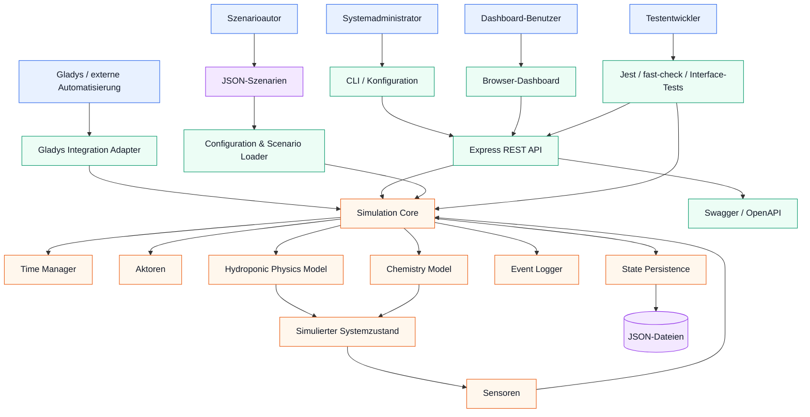
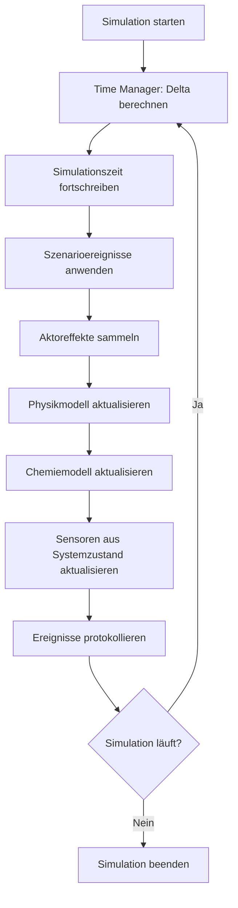
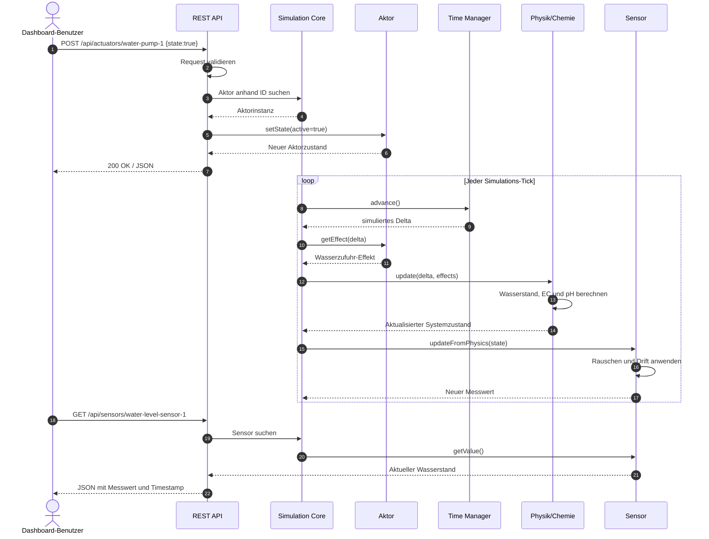
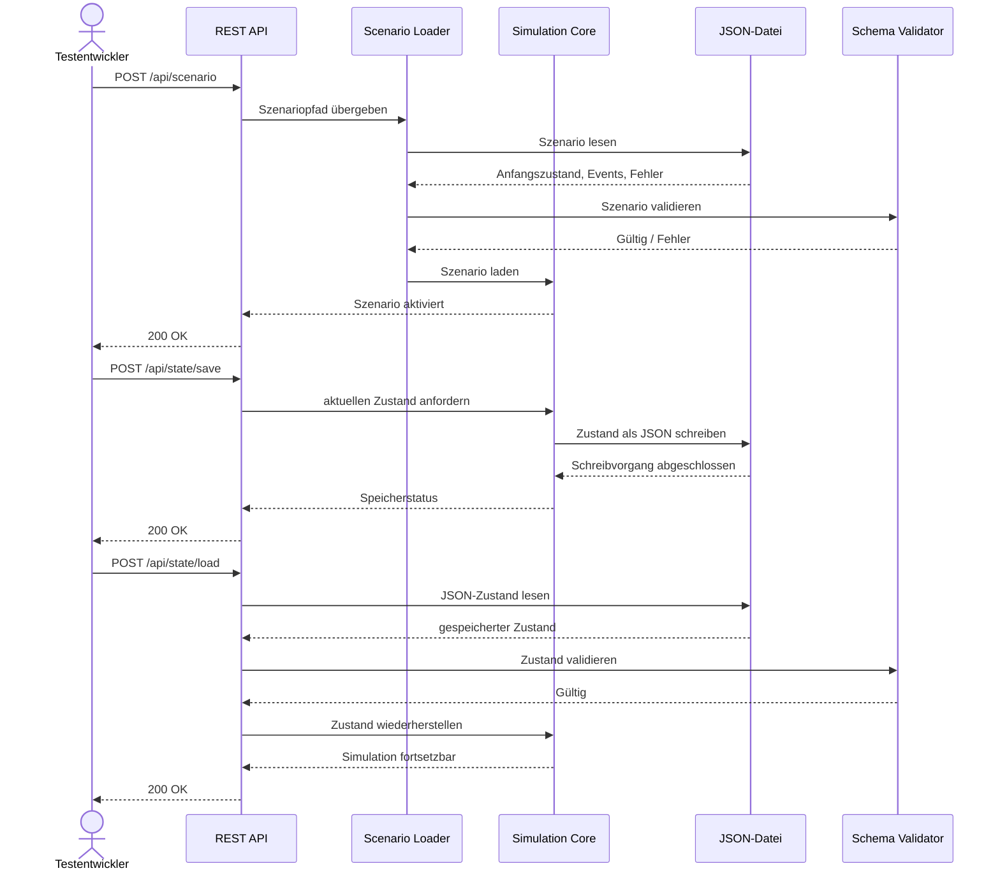

# Hydroponic Test Simulation — Architecture

## 1. Zweck und Umfang

Hydroponic Test Simulation ist ein TypeScript-basierter Simulator zum Testen von Überwachungs- und Steuerungsabläufen für hydroponische Systeme sowie der Integration in die Gladys-Hausautomation.

Die Anwendung simuliert Sensoren, Aktoren, Physik und Chemie in beschleunigter Simulationszeit und stellt den aktuellen Zustand über eine REST-API bereit. Unterstützt werden unter anderem:

- pH-, EC-, Temperatur- und Wasserstandssensoren;
- Wasser-, Nährstoff- und pH-Pumpen, Lampen und Ventile;
- Physik- und Chemie-Modelle für Verdunstung, Pflanzenaufnahme, Nährstoffkonzentration und pH-Pufferung;
- Szenarien, Fehlerfälle und persistierter Zustand;
- Gladys-kompatible Geräteerkennung und Aktorbefehle;
- Swagger/OpenAPI-Dokumentation;
- Dashboard- und Interface-Tests.

`Hydro_Model.jsx` ist ein separates interaktives Visualisierungs- und Prototyping-Modell. Es zeigt Abhängigkeiten zwischen Temperatur, pH, EC, Wasserstand, CO₂, Nährstoffverfügbarkeit und Pflanzenaufnahme.

## 2. Rollen und Verantwortlichkeiten

| Rolle | Verantwortlichkeiten | Typische Schnittstellen |
|---|---|---|
| **Systemadministrator / Betreiber** | Startet und konfiguriert den Simulator, verwaltet Ports, Logdateien und Persistenzdateien. | CLI, JSON-Konfiguration, Logs |
| **Testentwickler** | Erstellt Tests, Szenarien und Fehlerfälle; prüft deterministische Simulationsergebnisse. | Jest, fast-check, Szenario-API, `tests/` |
| **Integrationsentwickler** | Integriert den Simulator in Gladys oder andere Automationssysteme. | REST-API, `GladysIntegrationAdapter` |
| **Dashboard-Benutzer** | Beobachtet Sensorwerte, Systemstatus und Warnungen und steuert Aktoren. | Dashboard, Sensor- und Aktor-Endpunkte |
| **Szenarioautor** | Definiert Anfangszustände, zeitgesteuerte Ereignisse und Aktorausfälle. | `examples/scenarios/*.json` |
| **Entwickler / Maintainer** | Erweitert Sensoren, Aktoren, Physikmodelle, API und Dokumentation. | `src/`, Pull Requests, Tests |
| **Simulationskern** | Führt die Simulation aus, verarbeitet Zeit, Aktoreffekte, Physik, Sensoren und Ereignisse. | Interne TypeScript-Domänenobjekte |

Die Rollen sind logisch getrennt: Externe Benutzer und Systeme greifen ausschließlich über die dokumentierten Grenzen zu; der Simulationskern bleibt unabhängig von UI- und Integrationsdetails.

## 3. Architekturüberblick

Das Projekt verwendet eine modulare, geschichtete Architektur:



### Schichten

1. **Externe Schicht:** Dashboard, Gladys, CLI, Testclients und Szenario-Dateien.
2. **API- und Adapter-Schicht:** Express REST API, Swagger und Gladys-Adapter.
3. **Simulationskern:** Lebenszyklus, Taktung, Ereignisse, Persistenz und Orchestrierung.
4. **Domänenschicht:** Sensoren, Aktoren, Physik- und Chemie-Modelle.
5. **Konfigurations- und Dateischicht:** JSON-Konfiguration, Szenarien, gespeicherter Zustand und Logs.

Der Laufzeitzustand wird im Speicher gehalten. Ein externer Datenbank- oder Message-Broker ist nicht erforderlich.

## 4. Wichtige Komponenten

### Einstiegspunkt

`src/main.ts` verarbeitet CLI-Optionen, lädt die Konfiguration, erstellt die Simulationskomponenten und startet Simulation sowie HTTP-Server. Der kompilierte Einstiegspunkt ist `dist/main.js`.

### Simulationskern

- `src/core/simulation-core.ts` orchestriert Ticks, Zustandsänderungen, Sensoren, Aktoren, Physik, Szenarien und Lebenszyklusoperationen.
- `src/core/time-manager.ts` wandelt reale Zeit in Simulationszeit um und unterstützt Zeitbeschleunigung.
- `src/core/event-logger.ts` protokolliert relevante Simulations- und Systemereignisse.
- `src/core/state-persistence.ts` speichert und lädt den Zustand als JSON.

### Physik und Chemie

- `src/physics/hydroponic-physics-model.ts` modelliert Wasserbewegung, Verdunstung, Pflanzenaufnahme, Temperatur und Aktoreinflüsse.
- `src/physics/chemistry-model.ts` modelliert pH, EC, Nährstoffkonzentration und Pufferung.

### Sensoren und Aktoren

Sensoren lesen den physikalischen Zustand und können konfigurierbares Rauschen und Drift anwenden. Aktoren validieren Befehle, halten ihren Zustand und erzeugen `PhysicsEffect`-Werte für den nächsten Simulationsschritt.

### REST API und Gladys

- `src/api/rest-api-server.ts` stellt Sensor-, Aktor-, Simulations-, Konfigurations-, Szenario- und Persistenz-Endpunkte bereit.
- `src/api/swagger.ts` generiert die OpenAPI-Beschreibung und Swagger UI.
- `src/integration/gladys-integration-adapter.ts` übersetzt Gladys-Geräte- und Befehlsformate in interne Sensor- und Aktoroperationen.

Wichtige Endpunktgruppen:

| Bereich | Beispiele | Zweck |
|---|---|---|
| Sensoren | `GET /api/sensors`, `GET /api/sensors/:id` | Messwerte lesen |
| Aktoren | `GET /api/actuators`, `POST /api/actuators/:id` | Aktoren auslesen und steuern |
| Simulation | `/api/simulation/status`, `/start`, `/stop`, `/pause`, `/resume` | Lebenszyklus steuern |
| Zeit | `POST /api/simulation/time-acceleration` | Zeitfaktor ändern |
| Konfiguration | `GET/POST /api/config` | Konfiguration lesen und aktualisieren |
| Szenarien | `POST /api/scenario` | Szenario laden |
| Persistenz | `POST /api/state/save`, `/api/state/load` | Zustand speichern/laden |

Standardmäßig läuft der Server auf Port `3000`. Swagger UI ist unter `/api-docs` verfügbar.

## 5. Simulationsablauf



Die Zeitbeschleunigung skaliert das simulierte Delta, ohne notwendigerweise die externe API-Frequenz zu verändern:

```text
simuliertes Delta = reales Delta × Zeitbeschleunigungsfaktor
```

## 6. Sequenzdiagramm: Aktorbefehl und Messwert



## 7. Sequenzdiagramm: Szenario und Persistenz



## 8. Konfiguration und Datenfluss

Die Konfigurationspriorität ist:

1. Laufzeitänderungen über die API;
2. Szenariowerte;
3. Konfigurationsdatei;
4. Standardwerte.

Wichtige Bereiche sind `reservoir`, `sensors`, `actuators`, `physics`, `simulation` und `logging`. `src/config/` lädt Konfiguration und Szenarien, `src/schemas/` definiert die Strukturen und `src/utils/schema-validator.ts` validiert sie mit AJV.

## 9. Dashboard und Prototyp

Das Dashboard verwendet HTTP-Polling, um Sensorwerte und Simulationsstatus regelmäßig abzurufen. Benutzeraktionen senden Aktor- und Simulationsbefehle an die REST API.

`Hydro_Model.jsx` enthält zusätzlich eine React-basierte Visualisierung mit Dependency Graph, Kaskadenhervorhebung, Gesundheitswerten und einem optionalen KI-Beratungsbereich. Bei einer produktiven Integration sollte der externe KI-Aufruf über einen serverseitigen Proxy erfolgen, damit API-Schlüssel nicht im Browser liegen.

## 10. Repository-Struktur

```text
src/
├── main.ts                         # Anwendungseinstiegspunkt
├── index.ts                        # Öffentliche Exporte
├── types.ts                        # Gemeinsame Domänentypen
├── core/                           # Simulation, Zeit, Logging, Persistenz
├── sensors/                        # Sensorimplementierungen
├── actuators/                      # Pumpen, Lampen, Ventile
├── physics/                        # Physik- und Chemie-Modelle
├── integration/                    # Gladys-Adapter
├── api/                            # REST API und Swagger
├── config/                         # Konfiguration und Szenarien
├── schemas/                        # JSON-Schemas
└── utils/                          # Validierung und Rauschgenerator

tests/
├── unit/                           # Unit-Tests
├── property/                       # Property-based Tests
├── integration/                    # Integrationstests
└── fixtures/                       # Testdaten

examples/                           # Konfiguration und Szenarien
docs/                               # Mehrsprachige Dokumentation
scripts/                            # Interface- und Hilfsskripte
Hydro_Model.jsx                     # Interaktiver Visualisierungsprototyp
saved-state.json                    # Beispiel eines gespeicherten Zustands
```

## 11. Test-, Build- und Deployment-Architektur

Die Tests sind nach Umfang getrennt:

- Unit-Tests für einzelne Komponenten;
- Property-based Tests mit `fast-check` für Invarianten;
- Integrationstests für API, Kern, Persistenz und Gladys;
- Interface-Skripte für laufende HTTP-Endpunkte und Webseiten.

```bash
npm test
npm run test:coverage
npm run test:coverage:validate
npm run build
npm start
```

Der Build-Pfad lautet:

```text
TypeScript → tsc → dist/ → node dist/main.js
```

## 12. Designprinzipien und Grenzen

1. **Trennung der Zuständigkeiten:** Domänenlogik ist von API und UI getrennt.
2. **Deterministische Simulation:** Szenarien, Zeit und Zustand sind reproduzierbar.
3. **Austauschbare Adapter:** REST und Gladys greifen auf denselben Simulationskern zu.
4. **Konfigurierbare Realitätsnähe:** Rauschen, Drift, Ausfälle und Zeitbeschleunigung sind konfigurierbar.
5. **Validierung an Grenzen:** API-, Szenario- und Konfigurationsdaten werden geprüft.
6. **Beobachtbarkeit:** Logs und Status-Endpunkte machen die Ausführung sichtbar.
7. **Sicherheit:** Die aktuelle API ist für Entwicklung und Tests gedacht; für Produktion sind Authentifizierung, HTTPS, Rate Limiting und sichere Dateipfade erforderlich.
8. **Skalierung:** Der Zustand liegt im Speicher. Für horizontale Skalierung wären gemeinsamer Zustand oder ein dedizierter Simulationsbesitzer nötig.
