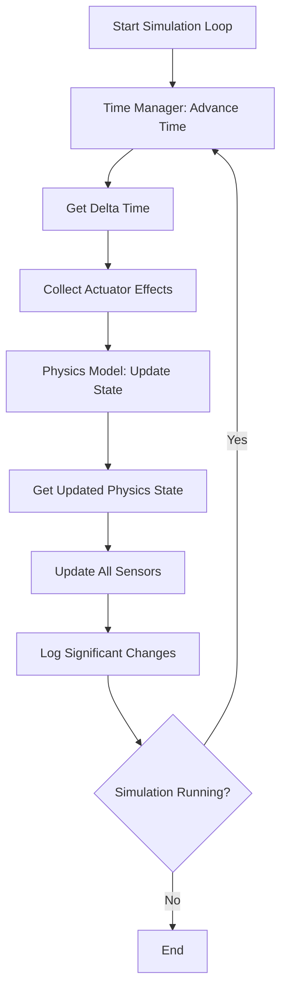
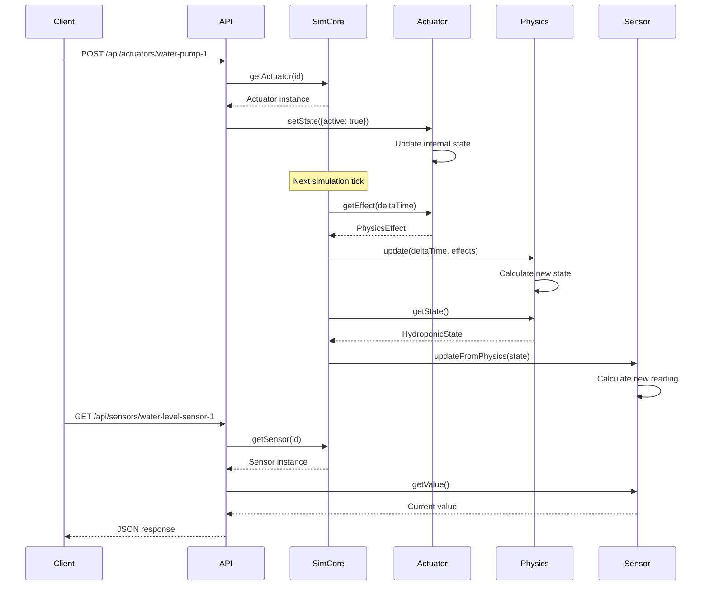
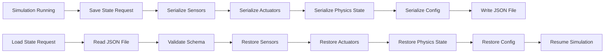

# Architecture Documentation

## System Architecture

### Overview

The Hydroponic Test Simulation uses a layered architecture that separates concerns and enables flexible testing:

```
┌─────────────────────────────────────────────────────────────────┐
│                        External Layer                            │
│  - Gladys Home Automation                                        │
│  - Test Automation Clients                                       │
│  - HTTP Clients                                                  │
└────────────────────────────┬────────────────────────────────────┘
                             │
┌────────────────────────────┴────────────────────────────────────┐
│                         API Layer                                │
│  ┌──────────────────────┐      ┌──────────────────────┐        │
│  │ REST API Server      │      │ Gladys Integration   │        │
│  │ - Express.js         │      │ Adapter              │        │
│  │ - Swagger UI         │      │ - Device Discovery   │        │
│  │ - JSON responses     │      │ - Command Mapping    │        │
│  └──────────────────────┘      └──────────────────────┘        │
└────────────────────────────┬────────────────────────────────────┘
                             │
┌────────────────────────────┴────────────────────────────────────┐
│                    Simulation Engine Layer                       │
│  ┌──────────────────────────────────────────────────────────┐  │
│  │                   Simulation Core                         │  │
│  │  - Lifecycle Management (start/stop/pause/resume)        │  │
│  │  - Component Registration                                │  │
│  │  - Simulation Loop Orchestration                         │  │
│  │  - Event Scheduling                                      │  │
│  └──────────────────────────────────────────────────────────┘  │
│                                                                  │
│  ┌──────────────┐  ┌──────────────┐  ┌──────────────────────┐ │
│  │ Time Manager │  │ Event Logger │  │ State Persistence    │ │
│  │ - Real time  │  │ - Log levels │  │ - Save/Load state    │ │
│  │ - Sim time   │  │ - Rotation   │  │ - JSON serialization │ │
│  │ - Accel      │  │ - Filtering  │  │ - Schema validation  │ │
│  └──────────────┘  └──────────────┘  └──────────────────────┘ │
└────────────────────────────┬────────────────────────────────────┘
                             │
┌────────────────────────────┴────────────────────────────────────┐
│                      Component Layer                             │
│  ┌──────────────────────┐      ┌──────────────────────┐        │
│  │ Sensors              │      │ Actuators            │        │
│  │ - pH Sensor          │      │ - Pump Actuator      │        │
│  │ - EC Sensor          │      │ - Light Actuator     │        │
│  │ - Temperature Sensor │      │ - Valve Actuator     │        │
│  │ - Water Level Sensor │      │                      │        │
│  └──────────────────────┘      └──────────────────────┘        │
└────────────────────────────┬────────────────────────────────────┘
                             │
┌────────────────────────────┴────────────────────────────────────┐
│                       Physics Layer                              │
│  ┌──────────────────────────────────────────────────────────┐  │
│  │              Hydroponic Physics Model                     │  │
│  │  - Water volume dynamics                                 │  │
│  │  - Nutrient concentration                                │  │
│  │  - Temperature dynamics                                  │  │
│  │  - pH dynamics                                           │  │
│  └──────────────────────────────────────────────────────────┘  │
│                                                                  │
│  ┌──────────────────────────────────────────────────────────┐  │
│  │                  Chemistry Model                          │  │
│  │  - pH buffering calculations                             │  │
│  │  - Nutrient concentration from EC                        │  │
│  │  - pH changes from nutrient addition                     │  │
│  └──────────────────────────────────────────────────────────┘  │
└──────────────────────────────────────────────────────────────────┘
```

## Component Interactions

### Simulation Loop Flow



### Actuator Command Flow



### State Persistence Flow



## Key Design Patterns

### 1. Component Registration Pattern

Components (sensors and actuators) register themselves with the Simulation Core:

```typescript
// Simulation Core maintains registries
private sensors: Map<string, Sensor>
private actuators: Map<string, Actuator>

// Components register during initialization
registerSensor(sensor: Sensor): void
registerActuator(actuator: Actuator): void
```

Benefits:
- Loose coupling between components
- Dynamic component discovery
- Easy to add new component types

### 2. Physics Effect Pattern

Actuators produce physics effects that are applied to the physics model:

```typescript
interface PhysicsEffect {
  type: 'water_addition' | 'nutrient_addition' | 'ph_adjustment' | 'heat'
  magnitude: number
  timestamp: number
}

// Actuators generate effects
actuator.getEffect(deltaTime): PhysicsEffect[]

// Physics model applies effects
physicsModel.update(deltaTime, effects)
```

Benefits:
- Separation of actuator logic from physics calculations
- Multiple effects can be combined
- Easy to add new effect types

### 3. Observer Pattern for Sensors

Sensors observe the physics model state:

```typescript
// Physics model maintains state
interface HydroponicState {
  ph: number
  ec: number
  temperature: number
  waterLevel: number
  // ...
}

// Sensors update from physics state
sensor.updateFromPhysics(state: HydroponicState)
```

Benefits:
- Sensors automatically reflect physics changes
- No tight coupling between sensors and physics
- Easy to add new sensor types

### 4. Time Acceleration Pattern

Time acceleration is implemented by scaling delta time:

```typescript
// Real time delta
const realDelta = 1 / tickRate  // e.g., 0.1 seconds

// Simulated time delta
const simDelta = realDelta * acceleration  // e.g., 1.0 seconds at 10x

// Physics uses simulated delta
physicsModel.update(simDelta, effects)
```

Benefits:
- External API sees normal update frequency
- Physics calculations use accelerated time
- Easy to change acceleration dynamically

## Data Models

### Sensor Data Model

```typescript
interface Sensor {
  id: string
  type: 'ph' | 'ec' | 'temperature' | 'water_level'
  baseline: number
  noiseStdDev: number
  driftRate: number
  
  getValue(): number
  getRawValue(): number
  setBaseline(value: number): void
  updateFromPhysics(state: HydroponicState): void
}
```

### Actuator Data Model

```typescript
interface Actuator {
  id: string
  type: 'pump' | 'light' | 'valve'
  
  getState(): ActuatorState
  setState(state: ActuatorState): void
  getEffect(deltaTime: number): PhysicsEffect[]
  getTotalRuntime(): number
}

interface ActuatorState {
  active: boolean
  intensity?: number  // For lights
  timestamp: number
}
```

### Physics State Model

```typescript
interface HydroponicState {
  ph: number
  ec: number
  temperature: number
  waterLevel: number
  waterVolume: number
  nutrientConcentration: number
  timestamp: number
}
```

## Configuration Architecture

### Configuration Hierarchy

```
Configuration Sources (Priority Order):
1. Runtime API calls (highest priority)
2. Scenario files
3. Configuration file
4. Default values (lowest priority)
```

### Configuration Schema

```typescript
interface SimulationConfig {
  reservoir: ReservoirConfig
  sensors: SensorConfigs
  actuators: ActuatorConfigs
  physics: PhysicsConfig
  simulation: SimulationSettings
  logging: LoggingConfig
}
```

Configuration is validated against JSON schemas to ensure correctness.

## Extensibility Points

### Adding New Sensor Types

1. Implement `Sensor` interface
2. Add sensor type to configuration schema
3. Register sensor with Simulation Core
4. Update physics model to provide relevant state

### Adding New Actuator Types

1. Implement `Actuator` interface
2. Define new `PhysicsEffect` types
3. Add actuator type to configuration schema
4. Update physics model to handle new effects

### Adding New Physics Behaviors

1. Extend `HydroponicState` interface
2. Update physics model calculations
3. Update sensors to use new state properties
4. Update configuration schema if needed

## Performance Considerations

### Simulation Tick Rate

Default: 10 ticks per second (100ms per tick)

Trade-offs:
- Higher tick rate: More accurate simulation, higher CPU usage
- Lower tick rate: Less accurate simulation, lower CPU usage

### Time Acceleration Limits

Maximum: 1000x acceleration

Limitations:
- Physics model accuracy decreases at very high acceleration
- Sensor noise patterns may become unrealistic
- Event timing resolution limited by tick rate

### Memory Usage

Typical memory footprint:
- Base simulation: ~10 MB
- Per sensor: ~1 KB
- Per actuator: ~1 KB
- Event log: ~100 bytes per event

## Security Considerations

### API Security

Current implementation:
- No authentication (development/testing only)
- Local network access only

Production recommendations:
- Add API key authentication
- Implement rate limiting
- Use HTTPS for remote access
- Validate all input parameters

### File System Access

The simulator reads/writes files for:
- Configuration loading
- Scenario loading
- State persistence
- Log files

Recommendations:
- Restrict file paths to designated directories
- Validate file paths to prevent directory traversal
- Use appropriate file permissions

## Testing Architecture

### Test Pyramid

```
        ┌─────────────────┐
        │   Integration   │  (10 tests)
        │     Tests       │
        ├─────────────────┤
        │   Property      │  (100+ tests)
        │   Based Tests   │
        ├─────────────────┤
        │   Unit Tests    │  (400+ tests)
        │                 │
        └─────────────────┘
```

### Property-Based Testing

Uses fast-check library to test universal properties:

- Sensor values always within valid ranges
- Physics conservation laws (mass, energy)
- State persistence round-trip correctness
- Time management monotonicity
- Configuration validation completeness

### Integration Testing

Tests complete workflows:
- End-to-end simulation scenarios
- API request/response cycles
- State save/load workflows
- Gladys integration compatibility
