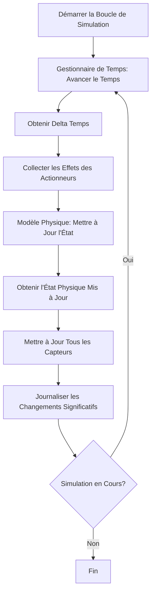
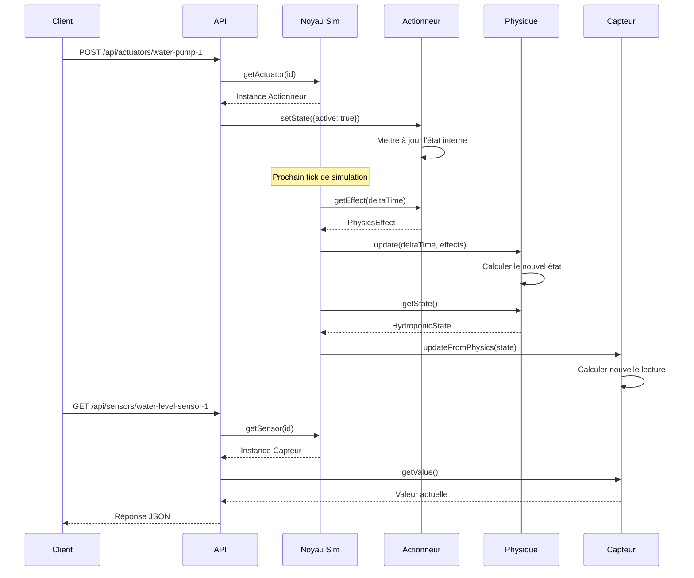
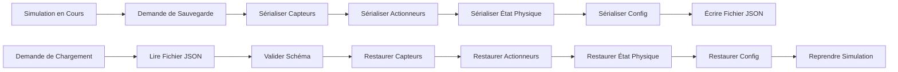

# Documentation de l'Architecture

## Architecture Système

### Vue d'ensemble

La Simulation de Test Hydroponique utilise une architecture en couches qui sépare les préoccupations et permet des tests flexibles :

```
┌─────────────────────────────────────────────────────────────────┐
│                       Couche Externe                             │
│  - Domotique Gladys                                              │
│  - Clients d'Automatisation de Tests                             │
│  - Clients HTTP                                                  │
└────────────────────────────┬────────────────────────────────────┘
                             │
┌────────────────────────────┴────────────────────────────────────┐
│                        Couche API                                │
│  ┌──────────────────────┐      ┌──────────────────────┐        │
│  │ Serveur API REST     │      │ Adaptateur           │        │
│  │ - Express.js         │      │ d'Intégration Gladys │        │
│  │ - Swagger UI         │      │ - Découverte         │        │
│  │ - Réponses JSON      │      │ - Mappage Commandes  │        │
│  └──────────────────────┘      └──────────────────────┘        │
└────────────────────────────┬────────────────────────────────────┘
                             │
┌────────────────────────────┴────────────────────────────────────┐
│                 Couche Moteur de Simulation                      │
│  ┌──────────────────────────────────────────────────────────┐  │
│  │              Noyau de Simulation                          │  │
│  │  - Gestion du Cycle de Vie (démarrer/arrêter/pause)     │  │
│  │  - Enregistrement des Composants                         │  │
│  │  - Orchestration de la Boucle de Simulation             │  │
│  │  - Planification des Événements                          │  │
│  └──────────────────────────────────────────────────────────┘  │
│                                                                  │
│  ┌──────────────┐  ┌──────────────┐  ┌──────────────────────┐ │
│  │ Gestionnaire │  │ Journal      │  │ Persistance d'État   │ │
│  │ de Temps     │  │ d'Événements │  │ - Sauvegarder/       │ │
│  │ - Temps réel │  │ - Niveaux    │  │   Charger l'état     │ │
│  │ - Temps sim  │  │ - Rotation   │  │ - Sérialisation JSON │ │
│  │ - Accél      │  │ - Filtrage   │  │ - Validation schéma  │ │
│  └──────────────┘  └──────────────┘  └──────────────────────┘ │
└────────────────────────────┬────────────────────────────────────┘
                             │
┌────────────────────────────┴────────────────────────────────────┐
│                     Couche Composants                            │
│  ┌──────────────────────┐      ┌──────────────────────┐        │
│  │ Capteurs             │      │ Actionneurs          │        │
│  │ - Capteur pH         │      │ - Actionneur Pompe   │        │
│  │ - Capteur EC         │      │ - Actionneur Lampe   │        │
│  │ - Capteur Température│      │ - Actionneur Vanne   │        │
│  │ - Capteur Niveau Eau │      │                      │        │
│  └──────────────────────┘      └──────────────────────┘        │
└────────────────────────────┬────────────────────────────────────┘
                             │
┌────────────────────────────┴────────────────────────────────────┐
│                      Couche Physique                             │
│  ┌──────────────────────────────────────────────────────────┐  │
│  │           Modèle Physique Hydroponique                    │  │
│  │  - Dynamique du volume d'eau                             │  │
│  │  - Concentration en nutriments                           │  │
│  │  - Dynamique de température                              │  │
│  │  - Dynamique du pH                                       │  │
│  └──────────────────────────────────────────────────────────┘  │
│                                                                  │
│  ┌──────────────────────────────────────────────────────────┐  │
│  │                 Modèle Chimique                           │  │
│  │  - Calculs de tamponnage du pH                           │  │
│  │  - Concentration en nutriments à partir de l'EC          │  │
│  │  - Changements de pH dus à l'ajout de nutriments         │  │
│  └──────────────────────────────────────────────────────────┘  │
└──────────────────────────────────────────────────────────────────┘
```

## Interactions des Composants

### Flux de la Boucle de Simulation



### Flux de Commande d'Actionneur



### Flux de Persistance d'État



## Modèles de Conception Clés

### 1. Modèle d'Enregistrement de Composants

Les composants (capteurs et actionneurs) s'enregistrent auprès du Noyau de Simulation :

```typescript
// Le Noyau de Simulation maintient des registres
private sensors: Map<string, Sensor>
private actuators: Map<string, Actuator>

// Les composants s'enregistrent lors de l'initialisation
registerSensor(sensor: Sensor): void
registerActuator(actuator: Actuator): void
```

Avantages :
- Couplage faible entre les composants
- Découverte dynamique des composants
- Facile d'ajouter de nouveaux types de composants

### 2. Modèle d'Effet Physique

Les actionneurs produisent des effets physiques appliqués au modèle physique :

```typescript
interface PhysicsEffect {
  type: 'water_addition' | 'nutrient_addition' | 'ph_adjustment' | 'heat'
  magnitude: number
  timestamp: number
}

// Les actionneurs génèrent des effets
actuator.getEffect(deltaTime): PhysicsEffect[]

// Le modèle physique applique les effets
physicsModel.update(deltaTime, effects)
```

Avantages :
- Séparation de la logique d'actionneur des calculs physiques
- Plusieurs effets peuvent être combinés
- Facile d'ajouter de nouveaux types d'effets

### 3. Modèle Observateur pour les Capteurs

Les capteurs observent l'état du modèle physique :

```typescript
// Le modèle physique maintient l'état
interface HydroponicState {
  ph: number
  ec: number
  temperature: number
  waterLevel: number
  // ...
}

// Les capteurs se mettent à jour depuis l'état physique
sensor.updateFromPhysics(state: HydroponicState)
```

Avantages :
- Les capteurs reflètent automatiquement les changements physiques
- Pas de couplage fort entre capteurs et physique
- Facile d'ajouter de nouveaux types de capteurs

### 4. Modèle d'Accélération Temporelle

L'accélération temporelle est implémentée en mettant à l'échelle le delta de temps :

```typescript
// Delta de temps réel
const realDelta = 1 / tickRate  // ex: 0.1 secondes

// Delta de temps simulé
const simDelta = realDelta * acceleration  // ex: 1.0 seconde à 10x

// La physique utilise le delta simulé
physicsModel.update(simDelta, effects)
```

Avantages :
- L'API externe voit une fréquence de mise à jour normale
- Les calculs physiques utilisent le temps accéléré
- Facile de changer l'accélération dynamiquement

## Modèles de Données

### Modèle de Données Capteur

```typescript
interface Sensor {
  id: string
  type: 'ph' | 'ec' | 'temperature' | 'water_level'
  baseline: number
  noiseStdDev: number
  driftRate: number
  
  getValue(): number
  getRawValue(): number
  setBaseline(value: number): void
  updateFromPhysics(state: HydroponicState): void
}
```

### Modèle de Données Actionneur

```typescript
interface Actuator {
  id: string
  type: 'pump' | 'light' | 'valve'
  
  getState(): ActuatorState
  setState(state: ActuatorState): void
  getEffect(deltaTime: number): PhysicsEffect[]
  getTotalRuntime(): number
}

interface ActuatorState {
  active: boolean
  intensity?: number  // Pour les lampes
  timestamp: number
}
```

### Modèle d'État Physique

```typescript
interface HydroponicState {
  ph: number
  ec: number
  temperature: number
  waterLevel: number
  waterVolume: number
  nutrientConcentration: number
  timestamp: number
}
```

## Architecture de Configuration

### Hiérarchie de Configuration

```
Sources de Configuration (Ordre de Priorité):
1. Appels API en temps d'exécution (priorité la plus élevée)
2. Fichiers de scénario
3. Fichier de configuration
4. Valeurs par défaut (priorité la plus basse)
```

### Schéma de Configuration

```typescript
interface SimulationConfig {
  reservoir: ReservoirConfig
  sensors: SensorConfigs
  actuators: ActuatorConfigs
  physics: PhysicsConfig
  simulation: SimulationSettings
  logging: LoggingConfig
}
```

La configuration est validée par rapport aux schémas JSON pour garantir l'exactitude.

## Points d'Extensibilité

### Ajout de Nouveaux Types de Capteurs

1. Implémenter l'interface `Sensor`
2. Ajouter le type de capteur au schéma de configuration
3. Enregistrer le capteur auprès du Noyau de Simulation
4. Mettre à jour le modèle physique pour fournir l'état pertinent

### Ajout de Nouveaux Types d'Actionneurs

1. Implémenter l'interface `Actuator`
2. Définir de nouveaux types `PhysicsEffect`
3. Ajouter le type d'actionneur au schéma de configuration
4. Mettre à jour le modèle physique pour gérer les nouveaux effets

### Ajout de Nouveaux Comportements Physiques

1. Étendre l'interface `HydroponicState`
2. Mettre à jour les calculs du modèle physique
3. Mettre à jour les capteurs pour utiliser les nouvelles propriétés d'état
4. Mettre à jour le schéma de configuration si nécessaire

## Considérations de Performance

### Fréquence de Tick de Simulation

Par défaut : 10 ticks par seconde (100ms par tick)

Compromis :
- Fréquence plus élevée : Simulation plus précise, utilisation CPU plus élevée
- Fréquence plus basse : Simulation moins précise, utilisation CPU plus faible

### Limites d'Accélération Temporelle

Maximum : Accélération 1000x

Limitations :
- La précision du modèle physique diminue à très haute accélération
- Les motifs de bruit des capteurs peuvent devenir irréalistes
- Résolution de timing des événements limitée par la fréquence de tick

### Utilisation Mémoire

Empreinte mémoire typique :
- Simulation de base : ~10 MB
- Par capteur : ~1 KB
- Par actionneur : ~1 KB
- Journal d'événements : ~100 octets par événement

## Considérations de Sécurité

### Sécurité API

Implémentation actuelle :
- Pas d'authentification (développement/test uniquement)
- Accès réseau local uniquement

Recommandations pour la production :
- Ajouter l'authentification par clé API
- Implémenter la limitation de débit
- Utiliser HTTPS pour l'accès distant
- Valider tous les paramètres d'entrée

### Accès au Système de Fichiers

Le simulateur lit/écrit des fichiers pour :
- Chargement de configuration
- Chargement de scénarios
- Persistance d'état
- Fichiers journaux

Recommandations :
- Restreindre les chemins de fichiers aux répertoires désignés
- Valider les chemins de fichiers pour empêcher la traversée de répertoires
- Utiliser les permissions de fichiers appropriées

## Architecture de Test

### Pyramide de Tests

```
        ┌─────────────────┐
        │   Tests         │  (10 tests)
        │   d'Intégration │
        ├─────────────────┤
        │   Tests Basés   │  (100+ tests)
        │   sur Propriétés│
        ├─────────────────┤
        │   Tests         │  (400+ tests)
        │   Unitaires     │
        └─────────────────┘
```

### Tests Basés sur les Propriétés

Utilise la bibliothèque fast-check pour tester les propriétés universelles :

- Les valeurs des capteurs toujours dans les plages valides
- Lois de conservation physique (masse, énergie)
- Exactitude de l'aller-retour de persistance d'état
- Monotonicité de la gestion du temps
- Complétude de la validation de configuration

### Tests d'Intégration

Teste les flux de travail complets :
- Scénarios de simulation de bout en bout
- Cycles requête/réponse API
- Flux de travail sauvegarde/chargement d'état
- Compatibilité d'intégration Gladys
